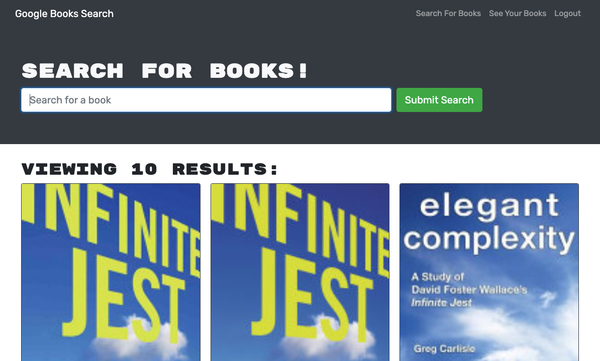

# Google Book Search 

### Deployed Link

The deployed app can be viewed here: https://peaceful-ocean-70006.herokuapp.com/

## Table of Contents

- [ About ](#about)
- [ Technologies ](#tech)
- [ License ](#license)
- [ Questions ](#questions)

## About

This application allows a user to search Google Book Search's database and save books to their account while logged in.

## Technologies

- Apollo Server and Apollo Provider
- GraphQL
- React, React Router
- Node.js
- Express.js

## License

MIT - A short and simple permissive license with conditions only requiring preservation of copyright and license notices. Licensed works, modifications, and larger works may be distributed under different terms and without source code. ([Read more about the MIT license](https://choosealicense.com/licenses/mit/))

## Questions

- [Find me on GitHub](https://github.com/cshepscorp/)
- Email me at: sheppard.christy@gmail.com
